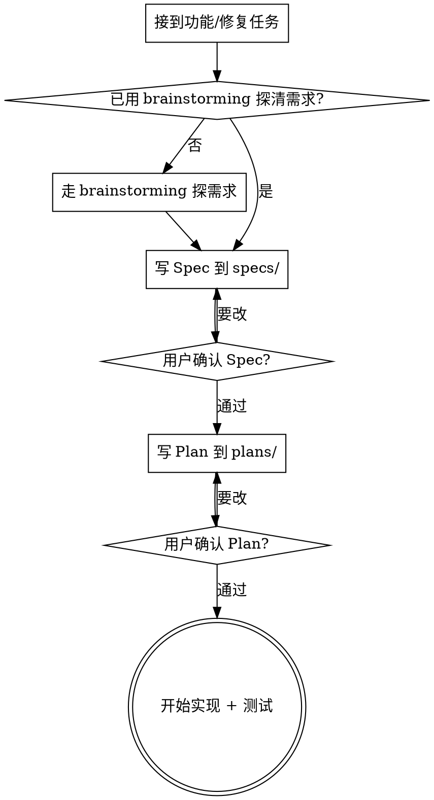

# 开发前先写 Spec 和 Plan

## 这是什么

本项目（ReflexionOS）的强制开发流程。任何**新增功能**或**修复 bug** 的任务，在动手写实现代码之前，必须依次产出两份文档并经用户确认：

1. **Spec（设计文档）** — 写到 `docs/superpowers/specs/YYYY-MM-DD-<主题>-design.md`
2. **Plan（实现计划）** — 写到 `docs/superpowers/plans/YYYY-MM-DD-<主题>-implementation-plan.md`

两者都是**硬性要求**，不可跳过。

## 强制门禁

<HARD-GATE>
在 spec 写完并经用户确认、plan 写完并经用户确认之前，禁止编辑或新建任何业务代码文件（backend/、frontend/ 下的实现代码）。
</HARD-GATE>

顺序固定：**Spec → 用户确认 → Plan → 用户确认 → 实现**。

## 流程

## 何时触发

只要任务会改动业务代码，就触发本流程：

- 新增功能（前端、后端、新接口、新组件）
- 修复 bug（哪怕看起来只是一行）
- 重构、调整已有行为

## 何时不触发

以下不算"开发"，无需走 spec/plan：

- 纯文档改动（README、devlog、注释）
- 配置/依赖调整（除非改动会引入业务逻辑）
- 回答问题、查代码、做调研
- 写本项目的流程类 skill 本身

判断标准：**这次改动会不会改变项目运行时的行为？** 会，就走流程。

## Spec 该写什么

参照 `docs/superpowers/specs/` 下已有文档的风格（中文，分小节）：

- **背景** — 现状是什么，为什么要做
- **目标 / 非目标** — 这次做什么，明确不做什么
- **用户故事 / 行为** — 从用户角度描述期望行为
- **方案** — 架构、涉及的模块、数据流、错误处理
- **边界与降级** — 异常情况怎么处理

写完做一次自检：有没有 TBD/占位、有没有自相矛盾、有没有歧义。修掉再交给用户。

## Plan 该写什么

如有 superpowers 的 `writing-plans` skill，优先调用它来生成 plan。核心要求：

- 拆成有序、可独立验证的步骤
- 每步标明改哪些文件、做什么、怎么验证
- 包含测试步骤

## 和 superpowers 的关系

本项目已安装 superpowers。本 skill 是对 superpowers `brainstorming` / `writing-plans` 工作流的**项目级强制约束**——superpowers 把 spec/plan 当推荐，本项目把它们当**必须**。能用 superpowers 的 skill 就用，产物落到上述两个目录即可。
