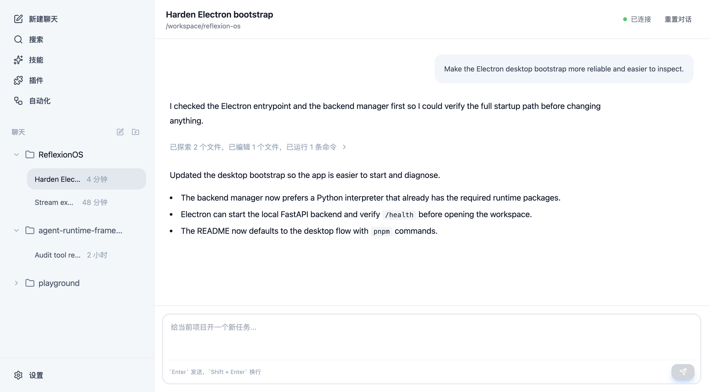
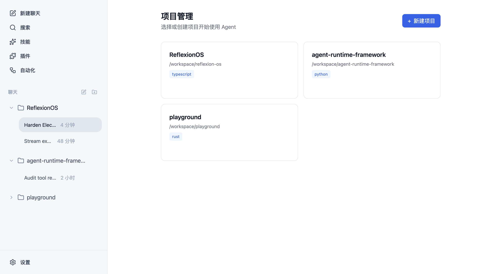
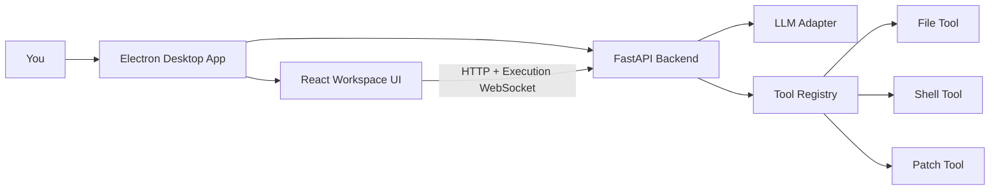

# ReflexionOS

> A transparent, local-first desktop coding agent with streaming tool receipts and patch-based code edits.

[](https://www.electronjs.org/)
[](#tech-stack)
[](#tech-stack)
[](#current-status)
[](./LICENSE)

ReflexionOS is built for people who want a Codex/Cursor-style agent experience, but with much more visibility into what the agent is actually doing.

Instead of hiding everything behind a single spinner, ReflexionOS lets you point an agent at a real local project and watch the work happen:

- what file it explores
- what command it runs
- what patch it applies
- when it is thinking, executing, or summarizing

If transparent coding agents are your thing, a star helps a lot.

## Screenshots

<p align="center">
  
  
</p>

## Why ReflexionOS

- **Desktop-first agent UX**: Electron shell, local project picker, multi-project workspace, and session-based chats.
- **Observable execution**: tool calls stream into the conversation as structured receipts instead of disappearing behind a spinner.
- **Patch-based editing**: code changes happen through unified diffs, which makes agent behavior easier to inspect and reason about.
- **Local project control**: the agent runs against paths on your machine with explicit path and shell security layers.
- **Built for iteration**: chat, inspect, cancel, retry, and continue without leaving the app.

## What Works Today

- Electron desktop app with a React workspace UI
- FastAPI backend for agent orchestration and APIs
- Single execution-stream WebSocket for realtime run events
- Session-based project conversations
- File, shell, and patch tools
- Action receipts for exploration, search, commands, and edits
- OpenAI-compatible configuration with API key and custom base URL
- Built-in skills registry foundation
- Project persistence and execution history APIs

## Product Snapshot

ReflexionOS is built around one simple loop:

1. Choose a local project
2. Ask the agent to inspect, debug, or change something
3. Watch the execution unfold in a visible, tool-driven conversation

The core bet is simple: **agent UX gets better when the work is visible**.

## Architecture



## Quick Start

### Recommended Desktop Development Path

`requirements.txt` is the only source of truth for Python dependencies.

1. Install backend dependencies:

```bash
cd backend
python -m pip install -r requirements.txt
```

2. Install frontend dependencies:

```bash
cd frontend
pnpm install
```

3. Start the desktop app:

```bash
cd frontend
pnpm dev
```

This starts the Vite renderer, launches Electron, and lets Electron auto-start the local FastAPI backend after it finds a Python environment that satisfies `backend/requirements.txt`.

If Electron cannot find that environment, point it to one explicitly:

```bash
export REFLEXION_PYTHON_PATH=/path/to/python
cd frontend
pnpm dev
```

### Build And Run The Desktop App

```bash
cd frontend
pnpm build
pnpm start
```

## Quick Demo Flow

1. Open the desktop app
2. Add a local project folder
3. Configure an OpenAI-compatible model endpoint
4. Ask the agent to inspect or change code
5. Watch tool receipts stream back into the chat

## Web Development Fallback

If you want to debug the frontend and backend separately, use the web fallback instead of the desktop shell.

Use the helper script from the repo root:

```bash
./start.sh
```

For Git Bash / WSL:

```bash
./start-dev.sh
```

Or run the two processes manually:

**Terminal 1**

```bash
cd backend
python -m uvicorn app.main:app --reload --host 127.0.0.1 --port 8000
```

**Terminal 2**

```bash
cd frontend
pnpm dev:web
```

## Tech Stack

- **Desktop shell**: Electron
- **Frontend**: React, TypeScript, Zustand, TailwindCSS, Framer Motion
- **Backend**: FastAPI, Python
- **Realtime transport**: single execution-stream WebSocket
- **LLM layer**: OpenAI-compatible adapter with native tool-call support
- **Editing model**: patch-first code modification flow

## Current Status

ReflexionOS is already usable as an experimental local coding agent workspace, but it is still early.

What that means in practice:

- core agent loop is implemented
- desktop shell is up and running
- project/chat UX is in place
- streaming execution feedback works
- some surfaces like plugins and automation are still scaffolded for future work

Backend test snapshot:

- **95 tests passing**

## Roadmap

- More LLM providers beyond the current OpenAI-compatible path
- Better code review and intervention workflows
- Richer project context and memory
- Plugin system and external integrations
- Automation and scheduled agent tasks
- Release packaging for easier desktop distribution

## Who This Is For

ReflexionOS is a good fit if you care about questions like:

- What does a transparent coding agent UX look like on desktop?
- How should an agent expose tool calls and edits to users?
- Can patch-based code generation feel safer and more understandable?
- What is the right balance between autonomy and observability?

If those questions are interesting to you, this repo is worth watching.

## Documentation

- [Documentation Guide](docs/README.md)
- [Primary Design Doc](docs/superpowers/specs/2026-04-15-reflexion-os-design.md)
- [Backend README](backend/README.md)

## Assets

To regenerate the README screenshots:

```bash
cd frontend
pnpm capture:screenshots
```

## License

MIT
