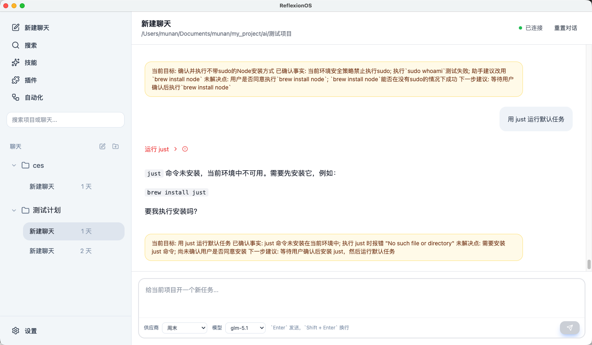
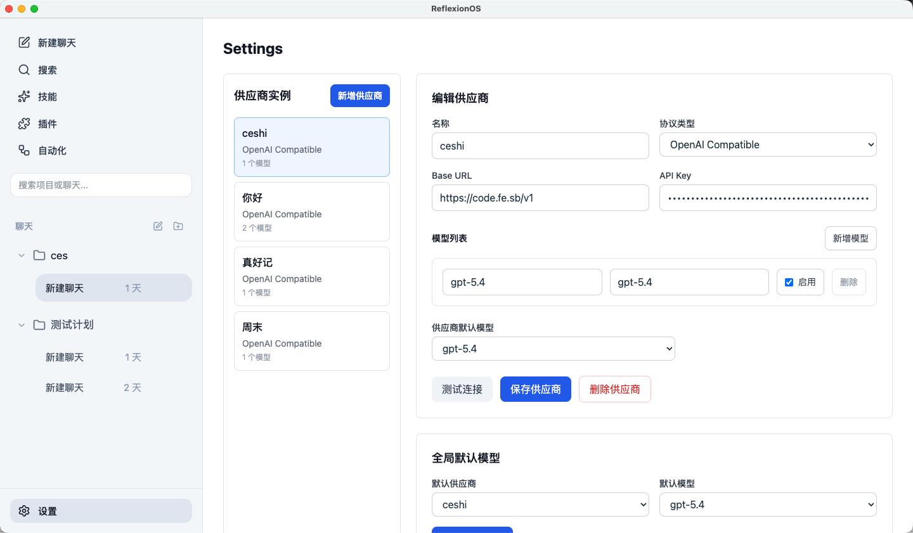
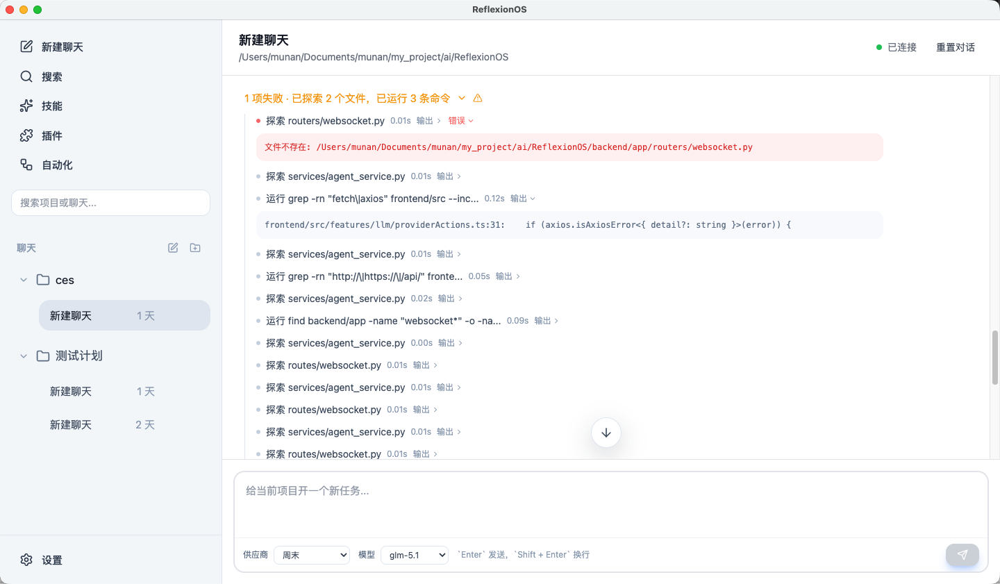
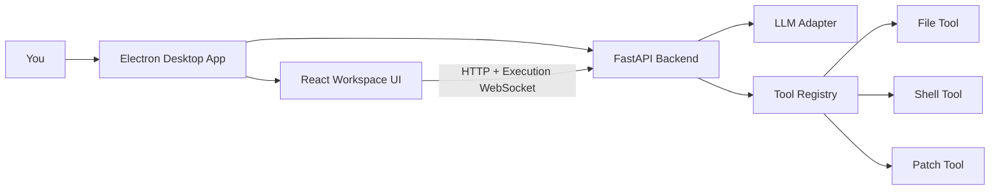

# ReflexionOS

> An open-source, local-first desktop coding agent — like Codex, but you can see what it's doing.

[](./LICENSE)
[](https://www.electronjs.org/)
[](https://www.python.org/)
[](https://react.dev/)

ReflexionOS is an open-source desktop coding agent. Point it at a local project, and the agent reads files, runs commands, and applies patches — with every step visible in real time.

If you've wondered how a coding agent like Codex works internally — how it calls tools, manages execution, handles security — this project is built to be readable and learnable.

## Screenshots





## Features

### Observable Execution

Agent actions don't disappear behind a spinner. Every tool call streams into the conversation as a structured **ActionReceipt** — you can see:

- What file it's reading
- What command it's running and the output
- What patch it's applying and which lines changed
- Whether it's thinking, executing, or summarizing

Not a log you check after the fact. Real-time, expandable, traceable.

### Patch-Based Code Editing

Code changes go through unified diffs (`apply_patch`), not whole-file rewrites:

- Small, auditable diffs instead of opaque file replacements
- You can see exactly which lines the agent changed
- Safer — no accidental rewrites from a single bad generation

### Deep Security System

The agent can run shell commands, but nothing goes unchecked:

- **8-level effect classification** — every command is rated from read-only to destructive
- **80+ pre-registered commands** — common commands have built-in risk ratings
- **Full pipeline detection** — `&&`, `||`, `;`, pipes, redirects, and command substitution are all classified correctly
- **Human approval for high-risk operations** — Approve/Deny buttons right in the UI
- **OS-level sandboxing** — Seatbelt on macOS, Landlock on Linux, real system-level isolation
- **Hard deny patterns** — `rm -rf /`, `curl | bash`, and similar patterns are always blocked

### Local-First, Desktop Native

- Electron desktop app — not a CLI, not a web-only tool
- Projects live on your machine, the agent operates on your real project paths
- Data stays local — no cloud storage, no telemetry
- Multi-project, multi-session workspace

## Architecture


```mermaid
flowchart LR
    U["You"] --> E["Electron Desktop App"]
    E --> F["React Workspace UI"]
    E --> B["FastAPI Backend"]
    F -->|HTTP + Execution WebSocket| B
    B --> L["LLM Adapter"]
    B --> T["Tool Registry"]
    T --> T1["File Tool"]
    T --> T2["Shell Tool"]
    T --> T3["Patch Tool"]
```

## Quick Start

### Recommended Desktop Development Path

`requirements.txt` is the only source of truth for Python dependencies.

1. Install backend dependencies:

```bash
conda create -n reflexion python=3.12
cd backend
python -m pip install -r requirements.txt
```

2. Install frontend dependencies:

```bash
cd frontend
pnpm install
```

3. Start the desktop app:

```bash
cd frontend
pnpm dev
```

This starts the Vite renderer, launches Electron, and lets Electron auto-start the local FastAPI backend after it finds a Python environment that satisfies `backend/requirements.txt`.

If Electron cannot find that environment, point it to one explicitly:

```bash
export REFLEXION_PYTHON_PATH=/path/to/python
cd frontend
pnpm dev
```

### Build And Run The Desktop App

```bash
cd frontend
pnpm build
pnpm start
```

### Package Desktop Releases

The normal development path still uses the local Python environment described above. Release
packages bundle a PyInstaller-built backend executable into the Electron app so end users do not
need to install Python, Node, pnpm, or backend dependencies.

Daily development still uses the existing command:

```bash
cd frontend
pnpm dev
```

Build macOS releases on macOS:

```bash
cd backend
python -m venv .venv
source .venv/bin/activate
python -m pip install -r requirements.txt

cd ../frontend
pnpm install
pnpm dist:mac
```

Build Windows releases on Windows:

```powershell
cd backend
py -3.12 -m venv .venv
.\.venv\Scripts\Activate.ps1
python -m pip install -r requirements.txt

cd ..\frontend
pnpm install
pnpm dist:win
```

Release artifacts are written to `frontend/release/`.

To build with GitHub Actions, open the `Release Desktop` workflow and run it manually, or push a
version tag:

```bash
git tag v0.1.0
git push origin v0.1.0
```

The workflow builds macOS and Windows artifacts separately and uploads them as workflow artifacts.

Build releases from a clean Python environment, such as a fresh virtualenv or CI runner. PyInstaller
analyzes the active environment, so global Conda environments with large optional packages can make
local smoke builds much slower and larger than CI builds.

The release skeleton is currently unsigned. macOS distribution still needs Developer ID signing and
notarization, and Windows distribution should use a code-signing certificate before public release.

## Quick Demo Flow

1. Open the desktop app
2. Add a local project folder
3. Configure an OpenAI-compatible model endpoint
4. Ask the agent to inspect or change code
5. Watch tool receipts stream back into the chat

## Troubleshooting

### `pnpm dev` crashes with `spawn … ENOENT` (macOS 15+ / 26)

On macOS 15 (Sequoia) and later — especially macOS 26 — Gatekeeper may
silently remove the unsigned Electron.app bundle from `node_modules` after it
is downloaded by the `electron` package's postinstall script. Only metadata
files (`LICENSE`, `version`) remain, and `pnpm dev` fails with:

```
Error: spawn …/electron/dist/Electron.app/Contents/MacOS/Electron ENOENT
```

ReflexionOS includes an automatic fix that runs before every `pnpm dev` launch
and after every `pnpm install`. If the issue still occurs, run the repair
script manually:

```bash
cd frontend
pnpm fix:electron          # check & repair
pnpm fix:electron -- --force  # force re-download & re-sign
```

The script re-downloads the Electron binary, strips macOS security attributes
(`com.apple.provenance`), and applies an ad-hoc code signature so Gatekeeper
stops removing it.

### Electron window doesn't open

If the Vite dev server starts but no Electron window appears, check whether
`ELECTRON_RUN_AS_NODE` is set in your shell environment:

```bash
echo $ELECTRON_RUN_AS_NODE
```

When set to `1`, Electron runs as a plain Node.js process without a GUI. The
`pnpm dev` script automatically strips this variable, but if you launch
Electron directly (`pnpm dev:desktop` or `pnpm start`), unset it first:

```bash
unset ELECTRON_RUN_AS_NODE
```

## Web Development Fallback

If you want to debug the frontend and backend separately, use the web fallback instead of the desktop shell.

Use the helper script from the repo root:

```bash
./start.sh
```

For Git Bash / WSL:

```bash
./start-dev.sh
```

Or run the two processes manually:

**Terminal 1**

```bash
cd backend
python -m uvicorn app.main:app --reload --host 127.0.0.1 --port 8000
```

**Terminal 2**

```bash
cd frontend
pnpm dev:web
```

## Tech Stack

- **Desktop shell**: Electron
- **Frontend**: React, TypeScript, Zustand, TailwindCSS, Framer Motion
- **Backend**: FastAPI, Python
- **Realtime transport**: single execution-stream WebSocket
- **LLM layer**: OpenAI-compatible adapter with native tool-call support
- **Editing model**: patch-first code modification flow

## Current Status

ReflexionOS is usable as an experimental local coding agent workspace, but it is still early.

- Core agent loop is implemented
- Desktop shell is up and running
- Project/chat UX is in place
- Streaming execution feedback works
- Some surfaces like plugins and automation are still scaffolded for future work

Backend test snapshot: **95 tests passing**

## Roadmap

- More LLM providers beyond the current OpenAI-compatible path
- Better code review and intervention workflows
- Richer project context and memory
- Plugin system and external integrations
- Automation and scheduled agent tasks
- Release packaging for easier desktop distribution

## Who This Is For

- Developers curious about how coding agents work internally
- People who want an agent they can observe and trust, not a black box
- Anyone building or contributing to open-source AI tooling
- Teams that need local-first, air-gapped agent tooling

## Documentation

- [Documentation Guide](docs/README.md)
- [Primary Design Doc](docs/superpowers/specs/2026-04-15-reflexion-os-design.md)
- [Backend README](backend/README.md)

## Assets

To regenerate the README screenshots:

```bash
cd frontend
pnpm capture:screenshots
```

## Community

<a href="https://linux.do/latest">LINUX DO</a>

## License

MIT
