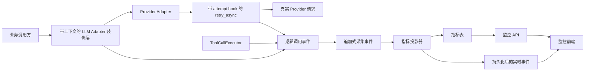
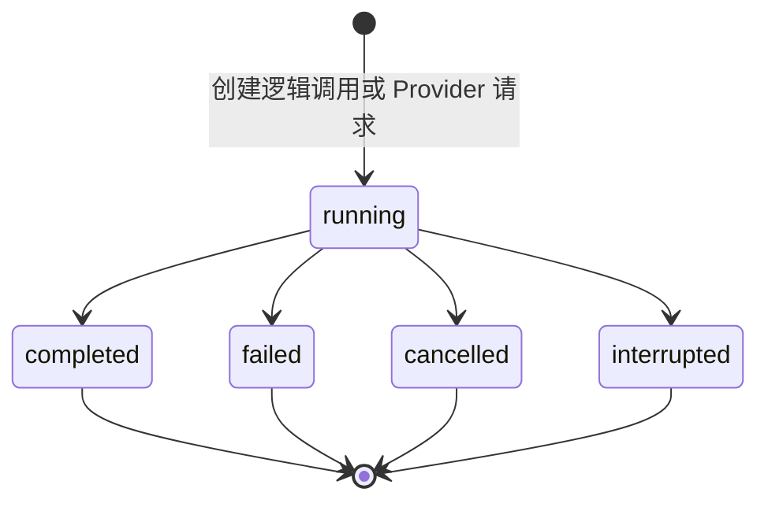
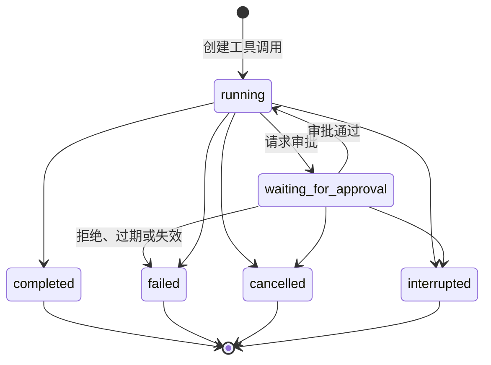

# ReflexionOS 监控平台设计方案

**日期：** 2026-07-25  
**状态：** 方案阶段  
**范围：** 对话执行、工具错误、模型用量、费用与性能监控

## 1. 建设目标

为 ReflexionOS 建设一个内嵌的监控中心，主要回答以下问题：

- 一次对话、一个项目、一个模型分别消耗了多少 Token 和费用？
- 一次运行为什么慢，耗时主要发生在哪个模型调用或工具调用？
- 哪些工具最容易失败，失败的具体原因是什么？
- 一次运行中发生了多少次重试、审批等待和拒绝？
- 能否从汇总指标中的异常记录追溯到原始对话？

监控中心使用 React 开发，作为现有前端中的独立页面模块。它需要同时支持 Electron
桌面应用和现有的浏览器开发模式。

## 2. 产品形态

监控中心在产品上保持独立，在工程上复用现有基础设施：

- 在现有侧边栏增加“监控中心”一级入口。
- 使用 `/monitoring` 下的独立前端路由。
- 在现有 FastAPI 后端中增加监控接口。
- 第一版继续使用现有 SQLite 数据库。
- 将数据采集、费用计算和聚合查询放进独立的可观测性模块，方便未来拆分。

第一版不单独建立仓库，也不部署成独立服务。当前监控数据和 `Project`、`Session`、
`Turn`、`Run`、`Message` 关系紧密，过早拆分会增加鉴权、部署、数据同步和跨服务追踪成本。

未来如需独立部署，可以在监控数据模型和 API 稳定后，将监控前端或存储层拆出，而不改变
执行端的数据采集协议。

## 3. 信息架构

### 3.1 运行总览

核心指标：

- 今日及所选时间范围内的总费用
- 输入、输出和缓存 Token
- 活跃运行数和已完成运行数
- 运行成功率
- 工具错误率
- 平均和 P95 运行耗时
- 平均和 P95 首 Token 延迟

辅助视图：

- 费用与 Token 趋势
- 工具失败排行
- 模型用量分布
- 最近错误
- 高消费对话排行

全局筛选条件：

- 时间范围
- 项目
- Provider
- 模型
- 运行状态
- Agent 模式

### 3.2 对话追踪

列表页面每一行代表一次 Run，显示：

- 开始时间
- 项目与会话
- Provider 与模型
- 输入、输出、缓存 Token
- 预估费用
- 工具调用次数
- 总耗时
- 运行状态

点击一条运行记录后进入详情页，按执行顺序展示时间线：

1. 用户消息
2. 第一次模型调用
3. 工具调用
4. 审批等待（如有）
5. 重试或后续模型调用
6. 最终回答

每个时间线节点显示：

- 开始和结束时间
- 执行状态
- 执行耗时
- Token 用量
- 费用
- 重试序号
- 脱敏后的错误详情

运行详情页需要提供返回原始对话的入口。

### 3.3 工具分析

按照工具名称聚合以下数据：

- 调用次数
- 成功和失败次数
- 成功率
- 平均、P50 和 P95 耗时
- 审批请求和拒绝次数
- 常见错误类型
- 最近的慢调用

工具错误统一归类为：

- `invalid_arguments`：参数错误
- `permission_denied`：权限不足
- `approval_denied`：用户拒绝审批
- `sandbox_blocked`：被沙箱拦截
- `command_failed`：命令执行失败
- `timeout`：执行超时
- `network_error`：网络错误
- `file_not_found`：文件不存在
- `patch_conflict`：补丁上下文冲突
- `internal_error`：内部错误

保留经过脱敏和长度限制的原始错误文本，方便进一步排查。

### 3.4 模型用量与费用

支持按照日期、项目、Provider、模型、会话和 Run 查看：

- 输入 Token
- 输出 Token
- 缓存输入 Token
- 总预估费用
- 重试产生的额外费用
- 每次成功运行的平均费用
- 消费最高的会话和运行

模型价格需要按照生效时间进行版本管理。历史费用使用调用发生时保存的价格快照，不能在查询时
直接使用最新价格重新计算，否则修改价格后历史数据会发生变化。

## 4. 数据模型

### 4.1 逻辑模型调用

表名：`llm_logical_calls`

一条记录表示业务层发起的一次模型调用。内部连接重试和流中断重连不会创建新的逻辑调用，
而是创建新的 Provider 请求记录。

| 字段 | 说明 |
| --- | --- |
| `id` | 系统生成的全局唯一 `logical_call_id` |
| `project_id` | 所属项目，原始数据删除后可为空 |
| `session_id` | 所属会话，原始数据删除后可为空 |
| `turn_id` | 所属 Turn，原始数据删除后可为空 |
| `run_id` | 所属 Run；标题生成等独立调用或原始数据删除后可为空 |
| `provider_id` | 业务调用选择的 Provider |
| `model_id` | 业务调用选择的模型 |
| `call_kind` | 主调用、最终总结、标题生成或上下文压缩 |
| `loop_iteration` | Agent 执行循环序号，不等同于传输重试序号 |
| `status` | `running`、`completed`、`failed`、`cancelled` 或 `interrupted` |
| `duration_ms` | 逻辑调用总耗时，包含内部重试等待 |
| `first_token_ms` | 从逻辑调用开始到首个有效 Token 的延迟 |
| `request_count` | 关联的真实 Provider 请求数量，作为投影缓存 |
| `total_cost_nano_usd` | 所有关联请求费用之和，作为投影缓存 |
| `started_at` | 逻辑调用开始时间 |
| `finished_at` | 逻辑调用结束时间 |
| `updated_at` | 最后状态更新时间 |
| `project_name_snapshot` | 调用发生时的项目名称快照，删除源数据时清空 |
| `session_title_snapshot` | 调用发生时的会话标题快照，删除源数据时清空 |
| `source_deleted_at` | 原始对话被删除的时间，可为空 |
| `superseded_at` | 所属 Run 被编辑重跑替代的时间，可为空 |

### 4.2 Provider 请求指标

表名：`llm_provider_requests`

一条记录对应一次真实 Provider HTTP 请求或流连接尝试，是 Usage、重试和计费的最小事实单位。

| 字段 | 说明 |
| --- | --- |
| `id` | 系统生成的全局唯一 `request_id` |
| `logical_call_id` | 所属逻辑模型调用 |
| `request_attempt_index` | 逻辑调用内从 0 递增的真实请求序号 |
| `provider_request_id` | Provider 返回的请求 ID，可为空 |
| `provider_id` | 实际请求的 Provider |
| `model_id` | 实际请求的模型 |
| `input_tokens` | Provider 返回的输入 Token，可为空 |
| `output_tokens` | Provider 返回的输出 Token，可为空 |
| `cached_input_tokens` | Provider 返回的缓存输入 Token，可为空 |
| `estimated_input_tokens` | 本地估算输入 Token，可为空 |
| `estimated_output_tokens` | 根据已接收输出内容计算的本地估算 Token，可为空 |
| `input_usage_source` | `provider`、`estimated` 或 `unavailable` |
| `output_usage_source` | `provider`、`estimated` 或 `unavailable` |
| `cached_usage_source` | `provider`、`zero_reported` 或 `unavailable` |
| `pricing_id` | 命中的模型价格记录 ID，可为空 |
| `pricing_match_rule` | 实际命中的 Provider 与模型匹配规则快照 |
| `pricing_version` | 费用计算规则版本 |
| `input_price_nano_usd_per_million` | 每百万输入 Token 单价快照 |
| `output_price_nano_usd_per_million` | 每百万输出 Token 单价快照 |
| `cached_input_price_nano_usd_per_million` | 每百万缓存输入 Token 单价快照 |
| `input_cost_nano_usd` | 输入费用，整数纳美元 |
| `output_cost_nano_usd` | 输出费用，整数纳美元 |
| `cached_input_cost_nano_usd` | 缓存输入费用，整数纳美元 |
| `total_cost_nano_usd` | 本次真实请求总费用，整数纳美元 |
| `cost_status` | `exact`、`estimated`、`incomplete` 或 `unpriced` |
| `status` | `running`、`completed`、`failed`、`cancelled` 或 `interrupted` |
| `duration_ms` | 真实请求或流连接持续时间 |
| `finish_reason` | Provider 返回的结束原因 |
| `error_code` | 标准化错误码 |
| `error_message` | 脱敏后的错误信息 |
| `started_at` | 请求开始时间 |
| `finished_at` | 请求结束时间 |
| `updated_at` | 最后状态更新时间 |

缓存用量未返回时必须记录为 `unavailable`，不能按 0 处理；只有 Provider 明确返回 0 时才使用
`zero_reported`。因此三类 Token 分别记录来源，费用汇总可以区分准确、估算和未知部分。

### 4.3 工具调用指标

表名：`tool_call_metrics`

| 字段 | 说明 |
| --- | --- |
| `id` | 系统生成的全局唯一 `tool_call_metric_id` |
| `invocation_id` | 执行器生成并贯穿所有工具事件的全局唯一幂等键 |
| `tool_call_id` | Provider 或兼容适配器提供的原始工具调用 ID，不保证全局唯一 |
| `source_run_id_hash` | 创建时计算且永不清空的 Run ID 哈希，用于删除后的幂等核对 |
| `project_id` | 所属项目，原始数据删除后可为空 |
| `session_id` | 所属会话，原始数据删除后可为空 |
| `turn_id` | 所属 Turn，原始数据删除后可为空 |
| `run_id` | 所属 Run，原始数据删除后可为空 |
| `tool_name` | 工具名称 |
| `status` | `running`、`waiting_for_approval`、`completed`、`failed`、`cancelled` 或 `interrupted` |
| `execution_duration_ms` | 工具实际执行耗时，不含审批等待 |
| `approval_wait_ms` | 审批等待耗时 |
| `total_duration_ms` | 从工具调用开始到终态的总耗时 |
| `error_category` | 标准化错误分类 |
| `error_message` | 脱敏后的错误信息 |
| `started_at` | 工具开始时间 |
| `execution_started_at` | 工具获得执行资格并真正开始的时间 |
| `finished_at` | 工具结束时间 |
| `updated_at` | 最后状态更新时间，用于悬挂修复 |
| `terminal_reason` | 正常完成、拒绝、超时、取消或进程中断 |
| `project_name_snapshot` | 调用发生时的项目名称快照，删除源数据时清空 |
| `session_title_snapshot` | 调用发生时的会话标题快照，删除源数据时清空 |
| `source_deleted_at` | 原始对话被删除的时间，可为空 |
| `superseded_at` | 所属 Run 被编辑重跑替代的时间，可为空 |

工具参数和输出继续保存在现有对话追踪数据中。监控指标表不重复保存可能包含敏感信息或内容过大的
工具参数和输出。

### 4.4 工具审批事件

表名：`tool_approval_events`

| 字段 | 说明 |
| --- | --- |
| `id` | 审批事件唯一 ID |
| `tool_call_metric_id` | 所属工具调用指标 |
| `approval_id` | 运行时审批 ID |
| `event_type` | `requested`、`approved`、`denied`、`expired` 或 `stale` |
| `actor_type` | 用户、系统恢复器或策略引擎 |
| `reason` | 脱敏后的决定原因 |
| `occurred_at` | 事件发生时间，UTC |

审批采用独立的追加式事件记录。一次工具调用允许出现多组请求与决定事件，但每个
`approval_id` 最多只能有一个决定终态。工具指标中的 `approval_wait_ms` 根据审批事件计算，
不能通过工具总耗时反推。

### 4.5 模型价格

表名：`model_pricing`

| 字段 | 说明 |
| --- | --- |
| `id` | 价格记录 ID |
| `provider_id` | Provider 范围 |
| `model_pattern` | 精确模型 ID 或受控匹配规则 |
| `match_type` | `exact` 或 `pattern` |
| `priority` | 模式匹配优先级；数值越大优先级越高 |
| `input_price_nano_usd_per_million` | 每百万输入 Token 价格，整数纳美元 |
| `output_price_nano_usd_per_million` | 每百万输出 Token 价格，整数纳美元 |
| `cached_input_price_nano_usd_per_million` | 每百万缓存输入 Token 价格，整数纳美元 |
| `currency` | 价格币种 |
| `effective_from` | 生效时间 |
| `effective_to` | 可选的失效时间 |

每条模型调用指标同时保存 `pricing_id`、匹配规则、计算版本、三类单价快照和计算结果。
金额全部使用整数纳美元存储，禁止使用二进制浮点数参与计费。展示层负责换算为美元或人民币，
因此既能保证历史金额不变，也能解释每一笔费用的计算过程。

价格记录采用不可变版本：修改价格时关闭旧记录的有效期并新增记录，不原地覆盖已经被调用指标
引用的价格。删除 Provider 配置也不删除历史价格记录。

价格匹配按以下确定性规则执行：

1. 只选择 `provider_id` 一致且满足 `effective_from <= started_at < effective_to` 的记录；
   `effective_to` 为空表示没有结束时间。
2. 精确模型 ID 优先于模式匹配。
3. 多个模式同时匹配时，选择 `priority` 最大的记录。
4. 同一 Provider、匹配规则和优先级的有效时间段禁止重叠，价格写入服务负责校验。
5. 如果最终仍出现多条同级候选，拒绝计价并记录 `cost_status=unpriced` 与
   `pricing_ambiguous`，不能任意选择一条。

### 4.6 追加式采集事件

表名：`observability_events`

采集事件是监控系统的原始事实，逻辑调用、Provider 请求、工具调用和审批表是可重建投影。

| 字段 | 说明 |
| --- | --- |
| `sequence` | SQLite `INTEGER PRIMARY KEY AUTOINCREMENT`，全局消费顺序 |
| `id` | 系统生成的全局唯一事件 ID，也是重放幂等键 |
| `entity_type` | `logical_call`、`provider_request`、`tool_call`、`approval` 或 `privacy_tombstone` |
| `entity_id` | 对应实体的系统内部 ID |
| `entity_version` | 同一实体内从 1 单调递增的事件版本 |
| `event_type` | 开始、状态变化、Usage、审批或终态事件 |
| `payload_json` | 经过脱敏且受大小限制的结构化数据 |
| `subject_project_id` | 隐私清理使用的项目关联，可为空 |
| `subject_session_id` | 隐私清理使用的会话关联，可为空 |
| `subject_run_id` | 隐私清理使用的 Run 关联，可为空 |
| `subject_type` | tombstone 的主体范围：`project`、`session` 或 `run`，普通事件可为空 |
| `subject_key_hash` | 不可逆关联哈希，用于 tombstone 和重放过滤 |
| `occurred_at` | 事件实际发生时间，UTC |
| `recorded_at` | 事件成功写入时间，UTC |
| `privacy_redacted_at` | 隐私擦除时间，可为空 |

事件的业务类型、实体版本、数值指标和发生时间写入后不可修改。唯一允许的原地变更是受删除服务
审计的隐私擦除：清空主体关联并将 `payload_json` 中的标识符、标题和错误文本替换为脱敏值，同时
写入 `privacy_redacted_at`。投影消费状态不写回事件行。

`sequence` 是唯一的全局消费游标，`occurred_at` 只表达业务时间，不能用于投影排序。
`entity_version` 防止延迟重放的低版本事件覆盖已经到达的终态。
同一实体的版本分配在采集器实体锁内完成，并由 `(entity_type, entity_id, entity_version)` 唯一约束
兜底；发生冲突时重新读取当前版本后重试，不能覆盖已有事件。

### 4.7 投影检查点

表名：`observability_projection_checkpoints`

| 字段 | 说明 |
| --- | --- |
| `projector_name` | 投影器名称，主键 |
| `last_projected_sequence` | 已完整提交的最大事件序列 |
| `updated_at` | 检查点更新时间 |
| `last_error_code` | 最近投影错误，可为空 |

事件表保持业务内容不可变，消费进度只保存在独立检查点中。

## 5. 数据采集链路



采集规则：

- 在后端执行链路中采集指标，不让前端根据聊天消息反向推测。
- LLM Adapter 装饰层创建 `logical_call_id`；Provider Adapter 内部的 `retry_async` 提供
  attempt 开始与结束 hook，每次执行 operation 前创建新的 `request_id`。
- `request_attempt_index` 在同一个逻辑调用内单调递增，连接重试和流中断重连都使用同一计数器。
- 装饰层记录逻辑调用总耗时；attempt hook 记录每次真实请求的状态、耗时、Usage 和费用。
- 业务层通过显式调用上下文传入 `project_id`、`session_id`、`turn_id`、`run_id` 和
  `call_kind`；未绑定 Run 的标题生成等调用仍需记录，并允许关联字段为空。
- 每一次真实的 Provider 请求生成一条 `llm_provider_requests` 记录，包括失败和重试请求。
- 优先使用 Provider 返回的 Token 用量。
- Provider 不返回用量时，保留本地 Token 估算值并标记为估算。
- 先写追加式采集事件，再生成投影和广播；客户端断线重连后通过 API 恢复权威数据。
- 监控采集失败不能导致 Agent 运行失败，但必须进入显式降级状态，禁止静默丢失。
- 对 API Key、Authorization Header、环境变量密钥和常见凭证格式进行脱敏。

## 6. 指标语义与不变量

### 6.1 采集可靠性与自监控

采集器采用以下降级顺序：

1. 正常情况下，同步将轻量事件追加到 SQLite `observability_events`，随后异步更新投影。
2. SQLite 事件写入失败时，将完整事件追加到独立的本地持久化 fallback journal，并由后台任务
   按事件 ID 重放。
3. 主事件库和 fallback journal 同时不可写时，进入有界内存队列并持续重试。
4. 内存队列达到上限时允许丢弃新事件，以保护 Agent 主流程，但必须增加
   `dropped_metrics_count` 并将健康状态设为 `critical`。

物理磁盘及 fallback 同时不可用时无法承诺绝对零丢失，因此系统承诺的是：健康状态下至少一次
采集、事件幂等投影；降级状态下明确暴露缺口，禁止静默显示为零。

监控系统暴露 `/api/monitoring/health`，至少返回：

- `status`：`healthy`、`degraded` 或 `critical`
- `last_event_recorded_at`
- `last_projection_at`
- `projection_lag_count`
- `fallback_backlog_count`
- `memory_queue_depth`
- `dropped_metrics_count`
- `last_error_code`
- `last_error_at`

监控前端在非 `healthy` 状态下持续显示数据完整性警告，所有费用和成功率标记为“可能不完整”。
健康计数器定期写入独立状态文件；状态文件也不可写时仍保留进程内告警并输出结构化错误日志。

### 6.2 顺序、重放与事务投影

- SQLite 为每个成功写入的事件分配严格递增的 `sequence`，投影器只按 `sequence ASC` 消费。
- fallback journal 使用独立递增的 `journal_sequence` 保持本地追加顺序，并保存事件 UUID 和
  `entity_version`。重放进入 SQLite 时再获得全局 `sequence`。
- fallback backlog 非空期间启用重放屏障：新事件继续进入 journal，不绕过 backlog 直接写入
  SQLite。单进程采集器先按 `journal_sequence` 排空 backlog，再恢复数据库直写。
- 投影行保存 `last_entity_version`。版本小于或等于当前值的重复、晚到事件只确认消费，不覆盖状态。
- 每个投影批次必须在同一个 SQLite 事务中完成：更新事实投影、更新实体版本、重算受影响的聚合
  缓存、更新 `last_projected_sequence`。任一步失败则整批回滚。
- `request_count`、`total_cost_nano_usd` 等累计字段不使用不可重放的 `+=`；当 Provider 请求事实
  变化时，通过关联请求记录执行 `COUNT`、`SUM` 重新计算，或使用带 `entity_version` 条件的确定性赋值。
- 投影器崩溃重启后从已提交 checkpoint 的下一个 `sequence` 继续，因此不会出现费用重复累计或
  事件已标完成但投影缺失。
- 全量重建开始时读取并保存 `rebuild_high_watermark=MAX(sequence)`，影子表只消费到该序号。
- 影子表完整应用截至高水位的事件和 tombstone 后，在同一个切换事务中替换当前投影，并将
  checkpoint 写为 `rebuild_high_watermark`；重建中间结果不对 API 暴露。
- 切换完成后，正常投影器从 `rebuild_high_watermark + 1` 继续消费。重建期间新增且序号更大的事件
  不会进入旧影子批次，也不会因切换而遗漏。

### 6.3 事件唯一性与调用终态

- 每次业务模型调用创建唯一 `logical_call_id`；每次真实 Provider operation attempt 创建唯一
  `request_id`，二者分别只能写入一个终态。
- 每次工具调用在解析参数前生成全局唯一 `invocation_id` 和 `tool_call_metric_id`，所有后续事件
  必须携带 `invocation_id`。原始 `tool_call_id` 只用于关联 Provider 输出，不作为全局幂等键。
- 兼容旧事件时使用 `(source_run_id_hash, tool_call_id)` 去重；删除原始 Run 后
  `source_run_id_hash` 仍保持不变。
- 每个已创建的模型或工具调用必须最终进入 `completed`、`failed`、`cancelled` 或
  `interrupted` 之一，禁止永久停留在 `running`。
- 参数解析失败、审批元数据缺失、策略拒绝和工具查找失败都属于工具终态，不能提前返回而不记账。
- `ToolCallExecutor` 的最外层使用统一终态收口，正常返回、提前返回和异常路径均经过同一个
  finalizer；终态更新使用条件更新，只有 `running` 或 `waiting_for_approval` 可以转为终态。
- 终态事件使用数据库唯一约束和幂等写入，重复回调不能产生重复指标或重复费用。

完整状态枚举和转换如下，数据库对状态字段建立 `CHECK` 约束：





审批事件枚举为 `requested`、`approved`、`denied`、`expired`、`stale`。每个审批先有
`requested`，之后最多进入一种决定终态；审批事件本身不复用工具状态枚举。

### 6.4 悬挂记录修复

应用启动和后台周期任务执行悬挂修复：

1. 查找处于非终态且所属 Run 已进入终态的调用。
2. 查找非终态且最后更新时间早于阈值、同时不存在对应活跃执行实例的调用。
3. 将其标记为 `interrupted`，写入 `terminal_reason=process_interrupted` 和修复时间。
4. 不伪造 `finished_at` 之前的执行耗时；无法确定的耗时字段保持为空。
5. 修复过程必须幂等，并记录结构化日志。

阈值只用于判断是否悬挂，不用于把仍在正常等待用户审批的调用提前结束。审批等待记录需要结合
活跃 Run、待审批存储和进程实例共同判断。

### 6.5 审批与耗时口径

- `total_duration_ms`：从工具调用指标创建到进入终态的墙钟时间。
- `approval_wait_ms`：所有有效审批请求到对应决定事件之间的时间之和。
- `execution_duration_ms`：工具真正开始执行到执行结束的时间，不含审批等待。
- 审批被拒绝或过期且工具从未执行时，`execution_started_at` 和 `execution_duration_ms` 为空。
- 页面时间线将审批展示为独立节点，不能把审批等待渲染成工具执行耗时。

### 6.6 Token 与费用口径

- Provider Usage 是准确值，本地 Token 计算是估算值，两者不能混为同一字段。
- 输入、输出和缓存 Token 分别记录来源；字段为空表示未知，只有
  `cached_usage_source=zero_reported` 才表示 Provider 明确报告缓存 Token 为 0。
- 有 Provider Usage 时使用 `input_tokens`、`output_tokens` 和 `cached_input_tokens` 计费。
- Provider 未返回 Usage 时，费用状态标记为 `estimated`；没有价格时标记为 `unpriced`。
- 每次 Provider 请求独立计费，失败请求只有在 Provider 返回 Usage 时才计入已知费用。
- 所有重试产生的费用都计入真实总消费，并通过 `request_attempt_index` 单独统计为重试费用。
- 金额使用整数纳美元；计算使用整数运算和明确的四舍五入规则，规则版本写入
  `pricing_version`。

`cost_status` 按以下优先级确定：

1. `unpriced`：缺少适用价格，或价格匹配存在冲突，无法完成计价。
2. `incomplete`：至少一个适用计费类别的 Usage 未知；已知部分费用可以展示，但不能称为总费用。
3. `estimated`：没有未知项，但至少一个适用类别使用本地 Token 估算值。
4. `exact`：所有适用计费类别均由 Provider 明确报告，包括明确报告为 0 的类别。

“适用计费类别”由命中的价格记录决定。例如价格定义了缓存输入单价而 Provider 没有返回缓存
Usage，则状态为 `incomplete`；没有缓存计价类别时，不因缓存 Usage 缺失降低完整性。

### 6.7 删除、编辑与重新运行

监控指标与原始对话采用不同生命周期：

- 删除会话或项目时，原始 `Run` 和 `Message` 继续按现有规则级联删除。
- 指标表不对会话和项目使用级联外键；关联 ID 可空。删除后只保留 Provider、模型、数值指标、
  价格快照和不可逆主体哈希，不保留项目名称、会话标题及原始错误文本。
- 删除服务在删除响应返回前暂停相关主体的新采集并完成以下操作：取消或结束活跃 Run；生成带
  `subject_key_hash` 的 `privacy_tombstone`；匿名化指标投影；对
  `observability_events` 执行受审计的隐私擦除；清理内存队列与 fallback backlog 中的关联内容。
- 原始事件隐私擦除会清空 `subject_project_id`、`subject_session_id`、`subject_run_id`，并从
  `payload_json` 删除 ID、标题、参数、输出和错误文本，只保留状态、Token、费用和耗时等非识别数据。
- fallback journal 的所有活动及轮转段在删除锁内进行原子重写：匹配主体的事件被匿名化，随后写入
  tombstone。重放器加载 tombstone 集合，任何晚到的同主体事件在入库前再次匿名化。
- journal 不是长期备份。成功重放的段立即删除；仅用于崩溃恢复的轮转段最长保留 7 天并自动清理。
  默认禁止生成包含原始 payload 的诊断备份；已有恢复段也必须参与删除时的原子重写。
- 投影器和全量重建器都把 tombstone 作为不可逆规则。即使更早事件稍后到达，也只能恢复脱敏计量
  事实，不能恢复已清除关联。全量重建在影子表完成并应用全部 tombstone 后才对外切换。
- 用户可通过独立的“清除监控数据”操作彻底删除指标。该操作与删除聊天分开，并明确提示历史
  费用将一并删除；该操作删除除 tombstone 外的匹配事件、投影和 journal backlog。tombstone
  使用 `subject_type + subject_key_hash` 唯一标识项目、会话或 Run 范围。非识别性的 tombstone 至少
  保留到所有可能包含旧事件的 journal 段超过 7 天保留期并完成清理，之后才能自动删除。
- 编辑并重新运行时，旧 Run 的指标继续保留，因为调用和费用已经真实发生；旧记录标记
  `superseded_at`，新 Run 使用新的 ID。
- 消费统计默认包含被替代 Run，运行成功率默认排除被替代 Run，页面可切换查看全部尝试。

### 6.8 时间、分页与聚合口径

- 数据库时间全部保存为 UTC，API 返回带 `Z` 或明确偏移的 ISO 8601 时间。
- “今日”由请求中的 IANA `timezone` 参数定义；未提供时使用客户端设置，仍未配置时回退系统时区。
- 时间范围使用半开区间 `[from, to)`，避免相邻区间重复统计。
- 明细列表统一按 `(started_at DESC, id DESC)` 排序，游标同时编码两个值，正确处理同一时间的记录。
- 聚合接口不使用 `cursor` 和 `limit`；它们使用时间粒度、Top N 和筛选参数。
- SQLite 第一版在过滤后的有限数据集上使用最近秩法计算 P95；查询设置最大时间范围和最大样本数，
  数据规模增长后再迁移到预聚合表或分析型存储。
- 成功率和耗时百分位只统计终态记录；`cancelled`、`interrupted` 单独展示，不计入成功率分母。
- 运行中的调用计入活跃数量和当前已知 Token/费用，但不进入成功率和耗时百分位。
- 费用按真实发生的调用统计，不因 Run 最终失败、取消、删除或被替代而移除。

### 6.9 索引与约束

第一版至少建立：

- `UNIQUE(llm_logical_calls.id)`
- `UNIQUE(llm_provider_requests.id)`
- `UNIQUE(llm_provider_requests.logical_call_id, request_attempt_index)`
- `UNIQUE(observability_events.id)`
- `UNIQUE(observability_events.entity_type, entity_id, entity_version)`
- `UNIQUE(observability_projection_checkpoints.projector_name)`
- `UNIQUE(tool_call_metrics.invocation_id)`
- `UNIQUE(tool_call_metrics.source_run_id_hash, tool_call_id)`
- `UNIQUE(tool_approval_events.approval_id, tool_approval_events.event_type)`
- 审批决定事件建立条件唯一索引，保证每个 `approval_id` 在 `approved`、`denied`、`expired`、
  `stale` 中最多出现一种终态
- `INDEX(llm_logical_calls.project_id, started_at)`
- `INDEX(llm_logical_calls.run_id, started_at)`
- `INDEX(llm_provider_requests.logical_call_id, request_attempt_index)`
- `INDEX(llm_provider_requests.provider_id, model_id, started_at)`
- `INDEX(tool_call_metrics.project_id, started_at)`
- `INDEX(tool_call_metrics.tool_name, started_at)`
- `INDEX(tool_call_metrics.run_id, started_at)`
- `INDEX(tool_call_metrics.status, updated_at)`，用于悬挂修复
- `UNIQUE(observability_events.sequence)`，由 `INTEGER PRIMARY KEY` 保证
- `INDEX(observability_events.sequence)`，用于顺序投影
- `INDEX(observability_events.subject_session_id, sequence)`，用于删除清理
- `INDEX(observability_events.subject_project_id, sequence)`，用于删除清理
- `CHECK` 约束分别限制逻辑调用、Provider 请求、工具调用和审批事件的合法枚举值
- 价格写入服务校验同一 Provider、匹配规则和优先级下的有效时间段不重叠

## 7. 与现有系统的结合

当前项目已经具备：

- `RunModel`：保存一次运行的整体状态。
- `tool_trace` 消息：保存工具名称、参数、状态、耗时和错误。
- `metrics:llm_call` 事件：包含模型、调用耗时、首 Token 延迟、Prompt Token 估算值和
  工具调用次数。

需要补充：

- 新增统一 LLM Adapter 装饰层，使主调用、总结、标题生成和上下文压缩都创建逻辑调用记录。
- 为 `retry_async` 增加 attempt 生命周期 hook，或传入已包装的 operation；每次 operation 实际执行
  前后创建并结束 Provider 请求记录。只包在 Provider Adapter 外层不满足采集要求。
- 流式早期断连的外层重连循环与 `retry_async` 共用同一个请求 attempt 计数器，避免序号重置。
- 将现有 `metrics:llm_call` 调整为持久化后的实时通知，避免它继续充当唯一数据来源。
- 扩展流式模型适配器，请求并采集 Provider 返回的准确 Usage。
- 在 Provider 支持时采集输出和缓存 Token。
- 重构工具执行器，以统一 finalizer 保证所有分支写入唯一终态。
- 持久化独立审批事件，并增加启动及周期性悬挂修复。
- 对工具错误和 Provider 错误进行标准化分类。
- 增加带生效时间的模型价格配置。

现有对话消息继续作为详细执行内容的来源；新增指标表负责筛选、统计和报表查询。

## 8. API 设计

第一版接口：

```text
GET /api/monitoring/overview
GET /api/monitoring/runs
GET /api/monitoring/runs/{run_id}
GET /api/monitoring/tools
GET /api/monitoring/errors
GET /api/monitoring/costs
GET /api/monitoring/models
GET /api/monitoring/health
GET /api/monitoring/pricing
PUT /api/monitoring/pricing
```

明细列表接口支持以下查询参数：

```text
from
to
project_id
session_id
provider_id
model_id
status
cursor
limit
timezone
```

明细列表使用 `(started_at, id)` 游标分页，不使用页码偏移分页。聚合接口不接收游标，使用
`from`、`to`、`timezone`、`bucket`、筛选条件和受上限约束的 `top_n`。

## 9. 前端结构

建议目录：

```text
frontend/src/features/monitoring/
├── api/
├── components/
├── hooks/
├── stores/
├── types/
└── utils/

frontend/src/pages/
├── MonitoringOverviewPage.tsx
├── MonitoringRunsPage.tsx
├── MonitoringRunDetailPage.tsx
├── MonitoringToolsPage.tsx
└── MonitoringCostsPage.tsx
```

前端路由：

```text
/monitoring
/monitoring/runs
/monitoring/runs/:runId
/monitoring/tools
/monitoring/costs
```

页面首次打开和查询历史数据时使用 HTTP API。页面保持打开时通过 WebSocket 接收活跃运行和
最新指标变化，但持久化 API 始终是最终数据来源。

## 10. 分阶段实施

### 第一阶段：准确采集数据

- 增加数据库迁移、数据模型和仓储。
- 持久化模型调用指标。
- 持久化工具调用指标。
- 增加追加式采集事件、指标投影器和本地 fallback 重放。
- 采集 Provider 返回的 Token Usage。
- 增加模型价格配置和费用计算。
- 增加错误标准化分类。
- 增加审批事件、统一终态收口和悬挂修复。
- 增加监控健康接口、降级提示和丢弃指标计数。
- 落实 UTC、删除保留、重新运行和费用快照不变量。
- 补充采集层和仓储层测试，包括并发顺序、重复重放、投影事务中断、低版本晚到事件、删除后
  全量重建、fallback backlog 匿名化和 journal 到期清理。

验收标准：在采集器为 `healthy` 时，每次完成的 Run 都有内部一致的逻辑调用、真实 Provider
请求、工具调用、Token、费用、耗时和错误记录；故障注入导致事件库不可写时，Agent 主流程继续
执行，fallback 能够重放，无法恢复的丢弃必须反映在健康接口和页面警告中。
删除项目或会话后执行全量投影重建，不得恢复任何已清除关联、标题、错误文本或详情链接。

### 第二阶段：对话执行追踪

- 增加 Run 列表和详情接口。
- 实现运行列表和执行时间线页面。
- 支持项目、状态、模型和时间筛选。
- 支持从监控记录跳回原始对话。

验收标准：能够解释一次 Run 的费用来源、耗时构成和失败过程。

### 第三阶段：聚合监控大盘

- 增加总览和聚合查询接口。
- 增加趋势、排行、百分位和错误分布。
- 实现工具分析和费用分析页面。

验收标准：能够定位异常项目、模型、工具和对话。

### 第四阶段：实时监控与告警

- 推送已持久化的实时指标变化。
- 增加费用预算和指标阈值。
- 增加连续失败、慢调用和高消费告警。
- 增加数据保留和导出设置。

验收标准：无需人工逐条检查即可发现活跃故障和预算异常。

## 11. 第一版范围

第一版包含：

- 准确的模型调用和工具调用指标采集
- 可配置的模型价格
- Run 列表
- Run 执行时间线详情
- 单次 Run 的 Token 和费用汇总
- 工具失败详情
- 按项目、时间、状态和模型筛选
- 从监控记录跳转回原始对话

第一版暂不包含：

- 外部告警通知
- 多用户登录和权限系统
- 独立部署
- 跨设备分布式追踪
- 长期大规模分析存储
- 与 Provider 账单自动对账

第一版优先保证对话级监控数据准确、可解释、可追溯，再逐步扩展为完整的运行监控平台。
