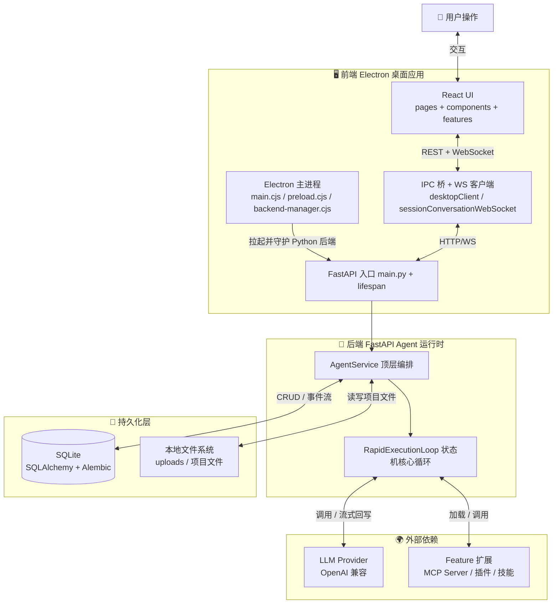
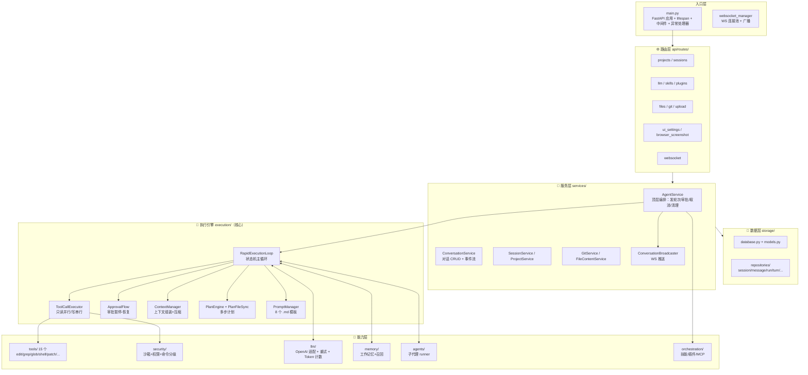
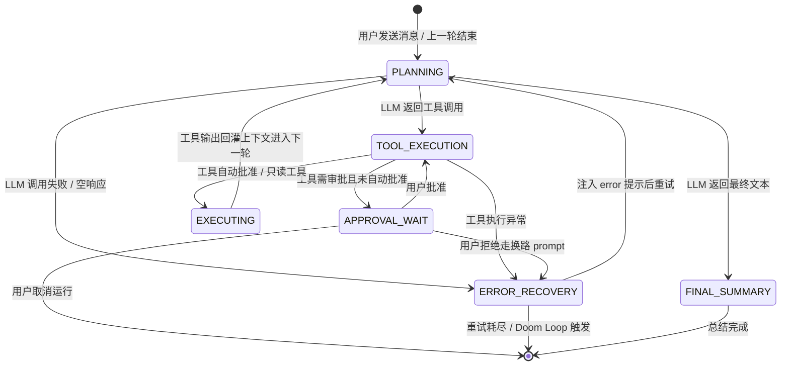
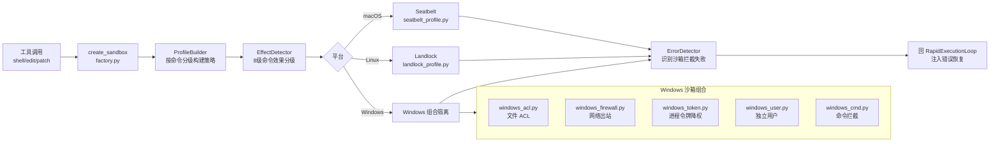
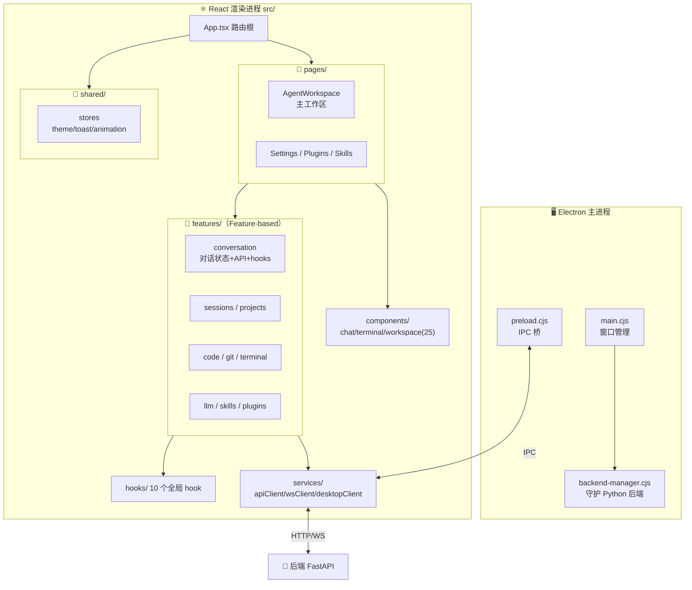

<!--
文件功能：ReflexionOS 项目架构图文档
文件描述：以 Mermaid 图 + 文字说明的方式，刻画系统整体分层、后端模块依赖、
         执行引擎核心状态机、一次用户消息的端到端数据流，以及关键设计决策。
         内容基于实际代码（main.py / app_services.py / rapid_loop.py / agent_service.py）
         验证，非凭空虚构。
-->

# ReflexionOS 项目架构图

> 生成时间：2026-09-15
> 说明：本文档基于实际代码验证绘制，与 `docs/DIRECTORY_TREE.md` 互补——
> 那份画"目录长什么样"，这份画"模块之间怎么协作"。

---

## 一、系统整体架构（宏观分层）

ReflexionOS 是一个 **AI 编程助手桌面应用**，采用 **Electron + React 前端** + **Python FastAPI 后端** 的双进程架构。前端是桌面壳，后端是 Agent 运行时核心。



**关键认知**：Electron 主进程的 `backend-manager.cjs` 负责**拉起并守护** Python 后端进程，这是桌面应用"前端带后端"的典型模式；前端和后端之间走 **REST（同步控制）+ WebSocket（流式对话回执）** 双通道。

---

## 二、后端模块分层图

后端按"路由 → 服务 → 执行引擎 → 工具/LLM/记忆/安全"分层，`AgentService` 是顶层编排者，`RapidExecutionLoop` 是心脏。



**分层职责一句话**：

| 层 | 职责 | 关键文件 |
|---|---|---|
| 入口层 | FastAPI 装配、生命周期（启动时恢复孤儿审批、扫技能）、全局异常 | [main.py](../backend/app/main.py) |
| 路由层 | 11 个 REST 路由 + WebSocket 端点 | [api/routes/](../backend/app/api/routes/) |
| 服务层 | 业务编排：对话/会话/项目/Git/广播 | [services/](../backend/app/services/) |
| 执行引擎 | **核心**：状态机驱动多轮循环、工具执行、审批、上下文压缩、计划 | [execution/](../backend/app/execution/) |
| 能力层 | LLM 适配、15 个工具、记忆、编排、安全沙箱、子代理 | llm/ tools/ memory/ orchestration/ security/ agents/ |
| 数据层 | 仓储模式，SQLAlchemy + Alembic | [storage/](../backend/app/storage/) |

---

## 三、执行引擎核心：状态机数据流（⭐ 最重要）

`RapidExecutionLoop` 用**显式状态机**驱动主循环（而不是单个庞大协程），这是整个项目最核心的设计。状态定义在 [execution/models.py](../backend/app/execution/models.py) 的 `LoopPhase`：



**几个非直觉的设计点**（面试可讲）：

- **只读并行 / 写串行**：只读工具（grep/glob/file 读取）并行执行提速，写操作（edit/shell/patch 有副作用）串行执行保证顺序正确性。
- **Doom Loop 检测**：`DOOM_LOOP_THRESHOLD = 3`，连续失败到阈值就触发状态转移或提示注入，防止 Agent 在错误里打转。
- **只读预算**：`MAX_READ_ONLY_PASSES = 50`，防止 Agent 无限调查不行动。
- **审批暂停-恢复**：审批等待是**状态机的暂停态**而不是阻塞协程，进程重启后靠 `recover_orphaned_approvals()` 恢复孤儿审批（见 [main.py:72](../backend/app/main.py#L72)）。
- **拒绝换路**：审批拒绝不直接终止，而是注入 `approval_rejected.md` prompt 让 LLM 换一条路径。

---

## 四、一次用户消息的端到端流转

以"用户在对话框输入一句话"为例，完整时序：

```mermaid
sequenceDiagram
    participant U as 👤 用户
    participant UI as React UI
    participant REST as REST API
    participant AS as AgentService
    participant LOOP as RapidExecutionLoop
    participant LLM as LLM Provider
    participant TOOLS as 工具层
    participant DB as SQLite
    participant BCAST as Broadcaster

    U->>UI : 输入消息并发送
    UI->>REST : POST /api/sessions/{id}/messages
    REST->>AS : 发起新轮次 start_turn
    AS->>DB : 持久化消息并创建 Run
    AS->>LOOP : 构造执行循环并启动

    loop 多轮循环 PLANNING 与 TOOL_EXECUTION 交替
        LOOP->>LLM : 组装上下文加 Prompt
        LLM-->>LOOP : 返回工具调用或最终回答

        alt 有工具调用
            LOOP->>TOOLS : 执行工具经沙箱审批
            TOOLS-->>LOOP : ToolResult
            LOOP->>BCAST : WS 推送操作回执
            BCAST-->>UI : 实时渲染 ActionReceipt
            LOOP->>LOOP : 工具输出回灌上下文进入下一轮
        else 无工具调用
            LOOP->>BCAST : WS 推送最终回答流式
            BCAST-->>UI : 流式渲染 Markdown
        end
    end

    LOOP-->>AS : LoopResult 完成或取消或失败
    AS->>DB : 落盘最终消息与 Run 状态
    AS->>BCAST : WS 推送 run 完成
    BCAST-->>UI : 会话状态更新
    U-->>UI : 看到结果
```

**关键点**：前端**不等 REST 请求返回才显示结果**——REST 只负责"发起轮次"，真正的对话流靠 **WebSocket 推送**（工具回执、流式文本、Run 状态变更）。这就是 [app_services.py](../backend/app/app_services.py) 里 `ConversationBroadcaster` 单例存在的原因。

---

## 五、安全沙箱架构（跨平台）

`security/sandbox/` 是 ReflexionOS 区别于普通 ChatBot 的核心——给 LLM 的工具调用套上 OS 级沙箱。工厂模式按平台创建：



**设计要点**：

- **命令效果分级**：`command_effect_registry.py` 给 110+ 预注册命令打 8 级效果标签，决定沙箱策略宽严。
- **权限模式**：`permission_mode.py` 支持 AUTO/ASK/YOLO 三种模式，决定是否走人工审批。
- **信任存储**：`session_trust_store.py` 记录会话级信任规则，支持级联自动批准。
- **错误识别**：沙箱拦截失败由 `error_detector.py` 识别后注入回执行循环，走 `ERROR_RECOVERY` 状态。

---

## 六、前端架构（Electron + React + Feature-based）



**前端分层要点**：

- **Feature-based 架构**：每个 feature 自带 `api/` + `stores/` + `hooks/` + `__tests__/`，高内聚低耦合。
- **双通道通信**：`apiClient.ts`（REST 同步） + `sessionConversationWebSocket.ts`（WS 流式）。
- **状态管理**：用 Zustand（`stores/` 下），不是 Redux。
- **Electron 桥**：`preload.cjs` 通过 `contextBridge` 暴露受限 IPC API 给渲染进程，桌面能力（终端、文件选择）走 `desktopClient.ts`。

---

## 七、技术栈速查

| 维度 | 技术选型 |
|---|---|
| 前端框架 | React 18 + TypeScript + Vite |
| 桌面壳 | Electron + electron-builder |
| 状态管理 | Zustand |
| 样式 | Tailwind CSS + PostCSS |
| 后端框架 | Python 3 + FastAPI |
| ORM/迁移 | SQLAlchemy + Alembic（SQLite） |
| 数据校验 | Pydantic |
| 通信 | RESTful + WebSocket（流式） |
| LLM 接入 | OpenAI 兼容接口 + 自定义 DSML 工具解析 |
| 安全沙箱 | macOS Seatbelt / Linux Landlock / Windows ACL+防火墙+令牌 |
| 打包 | Electron Builder（前端）+ PyInstaller（后端） |
| 测试 | pytest（后端 1131）+ vitest（前端 248） |

---

## 八、关键设计决策索引

| 决策 | 位置 | 为什么这么做 |
|---|---|---|
| 状态机驱动循环 | [rapid_loop.py](../backend/app/execution/rapid_loop.py) | 审批暂停/恢复、重试、错误恢复用状态转移显式表达，比嵌套协程可追踪 |
| 只读并行/写串行 | [tool_call_executor.py](../backend/app/execution/tool_call_executor.py) | 提速同时保证写操作顺序正确 |
| 服务单例懒加载 | [app_services.py](../backend/app/app_services.py) | PEP 562 `__getattr__` 避免导入时副作用，测试可注入 mock |
| 孤儿审批恢复 | [main.py:72](../backend/app/main.py#L72) | 进程重启后"等待审批"的 Run 会变孤儿，启动时主动清理 |
| 跨平台沙箱工厂 | [security/sandbox/factory.py](../backend/app/security/sandbox/factory.py) | 同一套接口，按平台选 Seatbelt/Landlock/Windows 组合 |
| WS 广播器单例 | [conversation_broadcaster.py](../backend/app/services/conversation_broadcaster.py) | 多处需要推送事件到前端，共享一个 WS 连接池 |
| 仓储模式 | [storage/repositories/](../backend/app/storage/repositories/) | 数据访问与业务逻辑解耦，便于测试替换 |
| Prompt 模板外置 | [execution/prompts/](../backend/app/execution/prompts/) 8 个 .md | Prompt 与代码分离，迭代不改代码 |

---

> 如需更新本文档，请同步检查 `docs/DIRECTORY_TREE.md` 是否一致——目录结构与架构是同一事物的两个视角。
