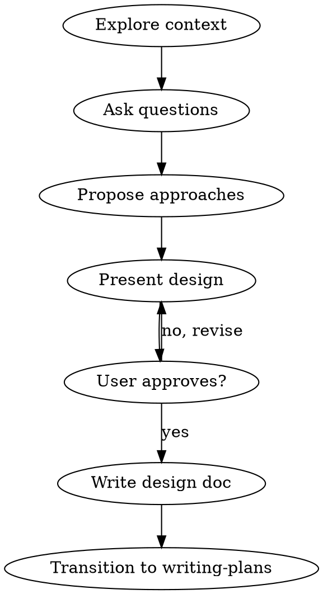

# Brainstorming Ideas Into Designs

## Overview

Help turn ideas into fully formed designs through collaborative dialogue before any code is written.

**Core principle:** understand the problem, propose approaches, present design, get approval — then implement.

<HARD-GATE>
Do NOT write any code, scaffold any project, or take any implementation action until you have presented a design and the user has approved it.
</HARD-GATE>

## When to Use

- Creating new features or components
- Adding functionality that changes behavior
- Requests where the implementation shape is unclear
- Tasks that involve design decisions with multiple valid approaches

Do not use for pure explanation, read-only investigation, or straightforward edits where the approach is already clear.

## Checklist

1. **Explore project context** — check files, docs, recent commits
2. **Ask clarifying questions** — one at a time, understand purpose/constraints/success criteria
3. **Propose 2-3 approaches** — with trade-offs and your recommendation
4. **Present design** — in sections, get user approval after each
5. **Write design doc** — save to `docs/superpowers/specs/YYYY-MM-DD-<topic>-design.md`
6. **Transition to implementation** — invoke writing-plans skill

## Process Flow

## Key Principles

- **One question at a time** — don't overwhelm
- **Multiple choice preferred** — easier to answer
- **YAGNI ruthlessly** — remove unnecessary features
- **Explore alternatives** — always propose 2-3 approaches
- **Incremental validation** — present design, get approval before moving on

## Anti-Pattern: "This Is Too Simple To Need A Design"

Every project goes through this process. "Simple" projects are where unexamined assumptions cause the most wasted work. The design can be short, but you MUST present it and get approval.

## Common Mistakes

| Mistake | Better move |
|---|---|
| Jumping straight to implementation | Ask what the user actually wants first |
| Asking 5 questions at once | One question per message |
| Only proposing one approach | Always offer 2-3 with trade-offs |
| Skipping user approval | Present design, wait for explicit approval |

## Red Flags

- "I'll just start coding and adjust later"
- "The approach is obvious"
- "I don't need to ask about this"

These mean you skipped the design phase. Go back.
