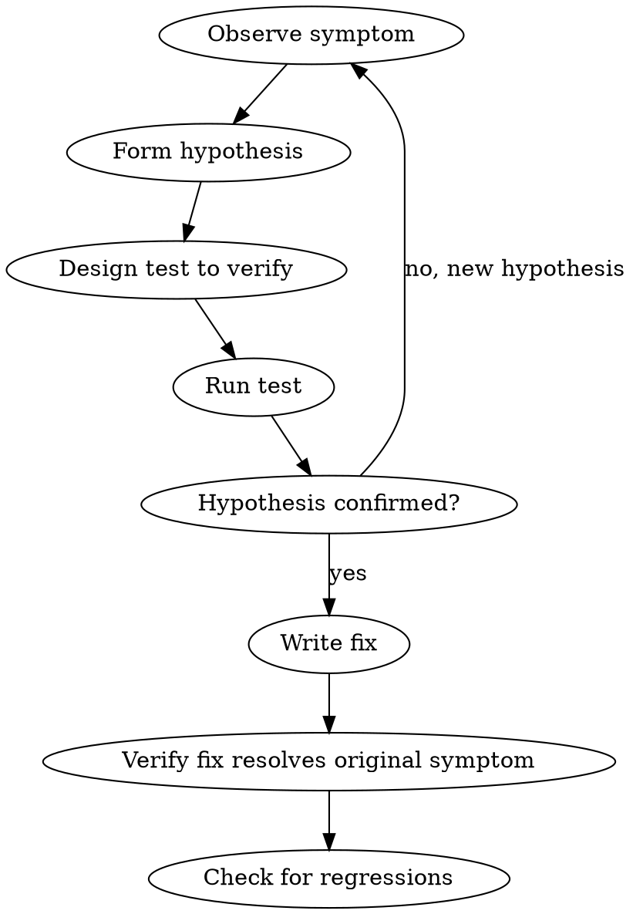

# Systematic Debugging

## Overview

Diagnose problems methodically before attempting fixes. Never guess at solutions.

**Core principle:** observe, hypothesize, verify — then fix. Never fix what you haven't diagnosed.

## When to Use

- Bugs and errors
- Flaky or failing tests
- Unexpected behavior
- Performance regressions
- Race conditions or timing issues

Do not use for feature implementation, refactoring, or straightforward configuration changes.

## The Debugging Loop

## Process

1. **Reproduce the problem** — get a reliable reproduction first
2. **Observe carefully** — read error messages, stack traces, logs
3. **Form a specific hypothesis** — "X is null because Y happens before Z"
4. **Design a test to verify** — the hypothesis must be falsifiable
5. **Run the test** — does it confirm or refute?
6. **Iterate** — new hypothesis if refuted
7. **Write the fix** — only after confirmed diagnosis
8. **Verify** — original symptom gone + no regressions

## Root Cause Tracing

Always trace to the root cause, not just the symptom:
- **Symptom:** "test fails with timeout"
- **Proximate cause:** "async operation not awaited"
- **Root cause:** "the API wrapper silently drops await in error path"

Fix the root cause, not the symptom.

## What This Skill Does Not Permit

- Fixing before diagnosing
- Trying multiple fixes hoping one works
- Ignoring flaky tests ("it passes sometimes")
- Treating error messages as the problem (they describe symptoms)
- Skipping regression verification

## Common Mistakes

| Mistake | Better move |
|---|---|
| Changing code to "see if it helps" | Form hypothesis first, verify before changing |
| Treating error message as the bug | Trace to root cause |
| Fixing the symptom | Fix the root cause |
| Skipping reproduction | Reproduce first, always |
| Assuming your first guess is right | Verify every hypothesis |

## Red Flags

- "Let me try changing this and see"
- "The error says X so the fix is Y"
- "It works on my machine"
- "I'll add a retry to handle the flake"
- "This test is flaky, skip it"

These mean you skipped diagnosis. Go back to the loop.
